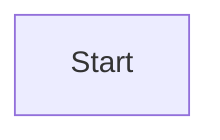

# Agent Guidelines for vscode-mermaid-syntax-highlight

This repository provides Markdown syntax support for the Mermaid charting language in VS Code. It uses TextMate grammars defined in YAML and compiled to JSON.

## 1. Build, Lint, and Test

### Dependencies

- **Install:** `npm install`

### Grammar Compilation

**Crucial:** The source of truth for grammars is in `syntaxes/`. The VS Code extension uses JSON files in `out/`, which are generated from the YAML files.

- **Compile YAML to JSON:** `npm run convertYaml`
- **Watch/Auto-compile:** Not explicitly provided, so run `npm run convertYaml` manually after any change to `syntaxes/**/*.yaml`.

### Testing

Tests verify that the generated grammar correctly scopes the Mermaid code.

- **Run All Tests:** `npm test`
- **Run Single Test File:**
  ```bash
  npx vscode-tmgrammar-test "tests/diagrams/graph.test.mermaid"
  ```
- **Recommended Workflow:**
  Always compile before testing to ensure your changes are active.
  ```bash
  npm run convertYaml && npm test
  ```

### Packaging

- **Create VSIX:** `npx @vscode/vsce package`

### Formatting

- **Format Code:** `npm run format:write` - must run before any commit to ensure consistent formatting.

## 2. Code Style & Conventions

### Grammar Definitions (`syntaxes/`)

- **Format:** YAML files in `syntaxes/diagrams/`.
- **Required Tests:** Every diagram grammar file must have one or more associated test files in `tests/diagrams/`. Tests are required to validate the grammar scoping and prevent regressions.
- **Custom YAML Tag `!regex`:**
  - Use `!regex |-` for all non-trivial regular expressions.
  - This allows multiline regexes with comments, which are stripped during compilation.
  - **Structure pattern:** Split the regex into multiple lines, with each line corresponding to a capture group. This makes it easier to match the regex with the associated capture group definition.

  **Example:**

  ```yaml
  match: !regex |-
    ^\s*(subgraph)\s+ # Matches the subgraph keyword
    (\w+)             # Matches the subgraph ID
  captures:
    '1':
      name: keyword.control.mermaid
    '2':
      name: variable
  ```

  **Becomes (in JSON):** `^\\s*(subgraph)\\s+(\\w+)`

- **Scopes:** Use standard TextMate scope names where possible.
  - `keyword.control.mermaid`: Keywords like `graph`, `subgraph`, `end`.
  - `entity.name.function.mermaid`: Names of diagrams or major sections.
  - `variable`: Node IDs, variables.
  - `string`: Text content, labels.
  - `comment`: Comments (`%%`).

### Test Files (`tests/`)

- **Format:** `.test.mermaid` (or `.md`, `.mdx`) files.
- **Whitespace Awareness:** These files are whitespace-aware. You must maintain consistent tabs/spacing throughout the file to avoid test errors.
- **Scope Assertion Rules:**
  - **Every non-commented line must have corresponding scope assertions below it.**
  - **Every non-whitespace character on the test line must have a corresponding scope validation line below it.** Assertions should not cover whitespace characters (spaces, tabs) - only test actual content.
  - **Scope specificity requirement:** Assertions must use specific TextMate scope names from the grammar (e.g., `keyword.control.mermaid`, `variable`, `string.quoted.double.mermaid`, `punctuation.separator.comma.mermaid`). Do not use generic scopes like `source.mermaid` or built-in values - the goal is human-readable/parsable test output.
  - **Grammar-first approach:** Before writing tests, ensure the grammar (`syntaxes/diagrams/*.yaml`) defines proper capture groups with specific scope names. If a grammar element lacks captures for parameters (like commas, strings, variables), either update the grammar to add them or test only the elements that are captured.
  - **Assertions must never be `source.mermaid`.** Use the most specific scope available (e.g., `variable`, `string.quoted.double.mermaid`, `punctuation.separator.comma.mermaid`).
  - **Assertion lines for a single line under test can never overlap.** Each character position on the line can only be asserted by exactly one assertion line. Multiple assertion lines must cover contiguous, non-overlapping spans.
  - Use comments (`%%`) for assertion lines - these are ignored by Mermaid but read by the test framework.
  - Assertion lines must directly follow the line they are testing (no blank lines between).
- **Defining Scopes:** There are two ways to identify the expected scope for a token:
  1. **Arrow (`<-----`):** Used when the text to check is at the very beginning of the line. The number of dashes corresponds to the number of characters from the start of the line to check.
     ```mermaid
     graph TD
     %% <----- keyword.control.mermaid
     %%     ^^ entity.name.function.mermaid
     ```
  2. **Caret (`^^^^`):** Used to check specific spans of text. The carets must align vertically with the characters on the line above.
     ```mermaid
     ID-1
     %%^^^^ variable
     ```

**Example of complete scope coverage:**



In this example:

- `graph TD` - "graph" is tested (5 chars at positions 1-5), then "TD" is tested (2 chars at positions 7-8)
- `    A[Start]` - 4 leading spaces are not tested, then "A" at position 5, "[" at position 6, "Start" at positions 7-11, "]" at position 12
- Assertions are ordered consecutively by their starting character position on the line

#### Automation (recommended)

**Problem:** Assertion lines are whitespace-sensitive and manual column counting is error-prone for humans and agents.

**Solution:** A small helper exists at [tests/tools/gen-assertions.js](tests/tools/gen-assertions.js). It accepts a test line and a compact JSON span map (1-based start or start-end → scope) and prints the test line plus aligned `%%` assertion lines ready to paste into the test file.

Usage example (call the existing script):

```bash
node tests/tools/gen-assertions.js 'Person(customer, "Customer", "A customer")' '{"1-6":"keyword.control.mermaid","7":"punctuation.parenthesis.open.mermaid","8-15":"variable","16":"punctuation.separator.comma.mermaid","18-27":"string.quoted.double.mermaid","28":"punctuation.separator.comma.mermaid","30-41":"string.quoted.double.mermaid","42":"punctuation.parenthesis.close.mermaid"}'
```

Example stdout (paste this under the test line):

```text
Person(customer, "Customer", "A customer")
%% <------ keyword.control.mermaid
%%    ^ punctuation.parenthesis.open.mermaid
%%     ^^^^^^^^ variable
%%             ^ punctuation.separator.comma.mermaid
%%               ^^^^^^^^^^ string.quoted.double.mermaid
%%                         ^ punctuation.separator.comma.mermaid
%%                           ^^^^^^^^^^^^ string.quoted.double.mermaid
%%                                       ^ punctuation.parenthesis.close.mermaid
```

Agent tip: prefer generating the compact span map and invoking the helper to avoid brittle manual spacing and reduce wasted test iterations.

### Debugging Grammar (for AI Agents)

**Problem:** When writing or debugging grammar patterns, it's difficult to see what the compiled regex actually produces and whether it matches the expected test assertions.

**Solution:** A debug tool exists at [tests/tools/debug-grammar.js](tests/tools/debug-grammar.js) that runs a single line through the compiled grammar and shows what scopes are matched.

**Usage:**

```bash
# Create a test file with the line to debug
echo 'Rel(customer, bankingSystem, "Uses", "HTTP")' > tests/tools/temp.txt

# Run the debug tool
node tests/tools/debug-grammar.js < tests/tools/temp.txt

# Or pipe directly (if your shell handles quotes)
node tests/tools/debug-grammar.js < <(echo 'Rel(customer, bankingSystem, "Uses", "HTTP")')
```

**Example output:**

```
=== Grammar Debug Tool ===
Line: "Rel(customer, bankingSystem, "Uses", "HTTP")"

Looking for patterns matching: "rel"

Found 2 patterns:

--- Pattern ---
Regex: (?i)^\s*(Rel|BiRel|...)
Comment: Rel with parameters
MATCHED: "Rel(customer, bankingSystem, "Uses", "HTTP")"
Captures:
  1: "Rel" -> keyword.control.mermaid
  2: "(" -> punctuation.section.group.begin.mermaid
  3: "customer" -> variable
  ...

=== Coverage Map ===
Line: Rel(customer, bankingSystem, "Uses", "HTTP")
Map:  ✓✓✓✓✓✓✓✓✓✓✓✓✓✓✓✓✓✓✓✓✓✓✓✓✓✓✓??✓✓✓✓✓✓??✓✓✓✓✓✓✓

By position:
  0: 'R' -> keyword.control.mermaid
  ...
 27: ',' -> (unmatched)
  28: '_' -> (unmatched)
```

**Key insights:**

- Shows all patterns containing the keyword (e.g., "Rel", "Person")
- Displays what each pattern captures and at which positions
- Coverage map shows `✓` for matched positions and `?` for unmatched
- Helps identify gaps in grammar coverage (e.g., missing comma/space captures)

**Tip:** After modifying a grammar, compile with `npm run convertYaml` before debugging to ensure the latest patterns are tested.

### Development Workflow

1.  **Analyze:** Break down the request into discrete grammar changes.
2.  **Iterate:** For each discrete change, complete the full cycle below before moving to the next change.
3.  **Implement:** Edit the appropriate `.yaml` file in `syntaxes/diagrams/`.
4.  **Compile:** Run `npm run convertYaml`.
5.  **Test:** Run `npm test` or a specific test file for the change.
6.  **Verify:** Confirm tests pass. If tests fail, debug and repeat steps 3-5.
7.  **Commit:** Once verified successful, commit the change before proceeding to the next discrete grammar change.
8.  **Repeat:** Continue until all grammar changes are complete.

**Iterative Workflow Principle:** Never implement multiple grammar changes in a single cycle. Each change must be implemented, tested, and committed separately. This ensures:

- Changes are easily reversible
- Test failures can be traced to specific changes
- The commit history accurately reflects the evolution of the grammar

### Directory Structure

- `syntaxes/`: **Edit here.** Source YAML grammar files.
- `out/`: **Do not edit.** Generated JSON grammar files.
- `tests/`: Test files with scope assertions.
- `build/`: Build scripts (e.g., `ConvertYaml.mjs`).

## 3. Cursor/Copilot Rules

_No specific `.cursor/rules` or `.github/copilot-instructions.md` were found in the repository._

## 4. Deployment Commit Workflow

When asked to create a deployment or release commit, follow these steps:

1.  **Update Version:**
    - Take the provided version number.
    - Update the `version` field in `package.json`.

2.  **Update Changelog:**
    - Add a new H2 header at the top of `CHANGELOG.md` following the existing format (e.g., `## [v1.2.3]`).
    - Below the header, add a very brief bulleted list of the changes from the current branch or prompt.

3.  **Create Commit:**
    - Create a commit including `package.json` and `CHANGELOG.md`.
    - Use the commit message format: `chore: bump version to <version number> for <very brief change>`

## 5. Agent Definitions

### Researcher

- **Role:** Analyzes syntax requirements and maps them to TextMate scopes.
- **Workflow:**
  1.  Uses input text and syntax documentation from [mermaid.js.org](https://mermaid.js.org/) to understand the diagram syntax.
  2.  Identifies necessary syntax changes or additions.
  3.  Reviews the existing codebase (`syntaxes/` directory) and general TextMate naming conventions.
  4.  Determines the appropriate TextMate scopes for each syntax token.
  5.  **Breaks down work:** Identifies discrete grammar changes and prioritizes them for iterative implementation.
  6.  **When uncertain about scope selection:** Ask the user for clarification. Provide:
      - The specific word/character in question
      - Example text/context showing where it appears
      - A brief explanation of why the scope is uncertain
      - Recommended scope(s) based on existing patterns

### Testing Agent

- **Role:** Creates and updates test cases to validate syntax highlighting.
- **Workflow:**
  1.  Modifies files in the `tests/` directory.
  2.  Applies the scopes determined by the Researcher.
  3.  Follows the repository's testing conventions (using `<-----` and `^^^^` markers) to create clear validation lines for the expected changes.
  4.  **IMPORTANT:** Every non-commented line in the test file must have corresponding scope assertions below it. Every non-whitespace character on the test line must have a corresponding scope validation line below it. Assertions should not cover whitespace characters.
  5.  **Scope specificity:** All scope assertions must use specific TextMate scope names from the grammar (e.g., `keyword.control.mermaid`, `variable`, `string.quoted.double.mermaid`, `punctuation.separator.comma.mermaid`). Do not use generic scopes like `source.mermaid` or built-in values - the goal is human-readable/parsable test output.
  6.  **Grammar-first approach:** Before writing tests, verify the grammar (`syntaxes/diagrams/*.yaml`) defines proper capture groups with specific scope names. If a grammar element lacks captures for parameters (like commas, strings, variables), either update the grammar to add them or test only the elements that are captured.
  7.  Works iteratively - creates and updates tests for one discrete grammar change at a time, coordinating with the Implementer to test each change before moving to the next.
  8.  **IMPORTANT:** Every non-commented line in the test file must have corresponding scope assertions below it. Every non-whitespace character on the test line must have a corresponding scope validation line below it. Assertions must never be `source.mermaid` and can never overlap with other assertions on the same line.
  9.  Works iteratively - creates and updates tests for one discrete grammar change at a time, coordinating with the Implementer to test each change before moving to the next.

### Implementer

- **Role:** Applies the syntax changes to the grammar files.
- **Workflow:**
  1.  Modifies the actual syntax definitions in `syntaxes/diagrams/*.yaml`.
  2.  Implements the regex patterns and scope mappings defined by the Researcher.
  3.  Ensures the YAML is valid and follows the `!regex` custom tag conventions described in the "Code Style & Conventions" section.
  4.  Works iteratively - implements one discrete grammar change at a time, compiles, tests, and commits before moving to the next change.
