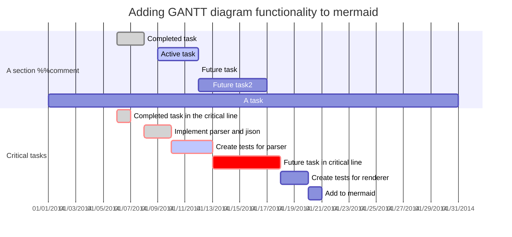
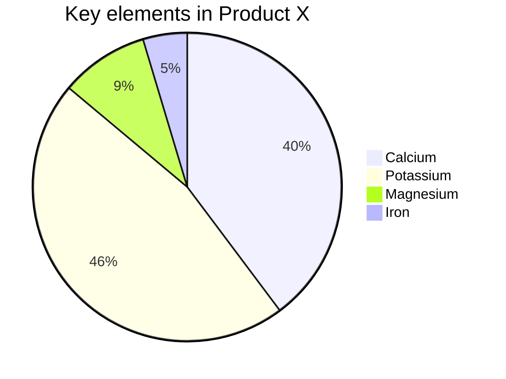
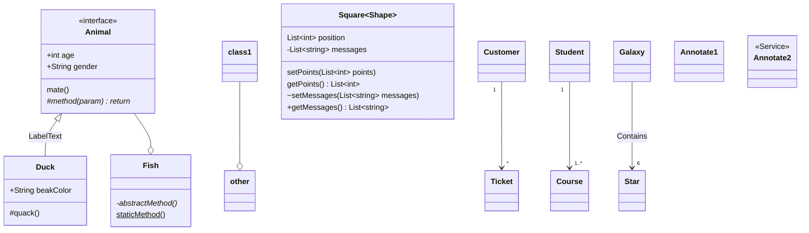

# vscode-mermaid-syntax-highlight
Syntax support for the [Mermaid charting language](https://github.com/knsv/mermaid)

[](https://marketplace.visualstudio.com/items?itemName=bpruitt-goddard.mermaid-markdown-syntax-highlighting) [](https://marketplace.visualstudio.com/items?itemName=bpruitt-goddard.mermaid-markdown-syntax-highlighting) [](https://marketplace.visualstudio.com/items?itemName=bpruitt-goddard.mermaid-markdown-syntax-highlighting)

Supports both fenced markdown (see screenshots), and mmd files.

## Screenshots/Progress

### Graph


```mermaid
graph TB %% comments
  %% Entity[Text]
  ID-1[Node 1]
  ID-2>Node 2]
  ID-3(Node 3 <br> text)
  %% Entity--Entity
  ID-1---ID-2
  ID-1 --> ID-3
  %% Entity--Text--Entity
  ID-2--Link between 2 and 3---ID-3
  ID-3-->|Action from 3 to 1|ID-1
  ID-3 -- "Action from 3 to 2. p/w: '_-!#$%^&*+=?,\'" --> ID-2
  %% Complex cases
  A[Hard edge] -->|Link text| B(Round edge)
  ID-1---ID-2(Text)
  B --> C{Text}
  C -->|One| D[Text]
  A(A) --> B(B)
  C[/C/] --> D>D]
  %% class/classDef
  classDef blue fill:#08f,stroke:#fff;
  class ID-1 blue
  class ID-1,ID-2 red
  %% click
  click ID-1 "https://github.com" "Tooltip text" %% comments
  click ID-2 alert "Tooltip for a callback"
  %% subgraph
  subgraph A subgraph
    ID-4{Node 4}
    ID-5((fa:fa-spinner))
    ID-6["Node 6 (same #quot;shape#quot;)"]
    ID-4-.->ID-5
    ID-5 -. Action from 5 to 4 .-> ID-4
    ID-5==>ID-6
    ID-6 == Action from 6 to 5 ==> ID-5
  end
```

#### Progress

- [x] Keywords
- [x] %% Comments
- [x] Entity---Entity (livne )
- [x] Entity---Text---Entity
- [x] Entity-->|Text|Entity
- [x] Entity-->|Special Chars|Entity
- [x] Entity[Text]
- [x] classDef
- [x] class
- [x] click

### Sequence


```mermaid
sequenceDiagram %% diagram
  %% participant
  participant Alice
  participant B as Bob</br>Newline
  participant C as Carol
  %% arrows
  B->C: Solid line without arrow
  B-->C: Dotted line without arrow
  B->>C:Solid line with arrowhead
  B-->>C: Dotted line with arrowhead
  B-xC: Solid line with a cross at end
  B--xC: Dotted line with a cross at end
  %% activations
  activate John
  deactivate John
  %% activation shorthand
  Bob->>+Carol: Hello Carol, how are you?
  B-->>-C: Great!
  %% notes
  Note left of Alice: Alice likes to chat
  Note over B,C: Bob whispers when sick
  %% loop
  loop Every minute
        B-->C: Can you hear me?
  end
  %% alt
  alt is sick
    B-->C: Not so good :(
  else is well
    B->C: Feeling fresh like a daisy
  end
  opt Extra response
    B->C: You, Carol?
  end
```

- [x] Keywords
- [x] %% Comments
- [x] participant Actor
- [x] participant Aliases
- [x] Actor->>Actor: Message
- [x] 6 arrow types
- [x] (de)activate Actor
- [x] activate/deactivate shorthand (+/-)
- [x] Note Action Actor
- [x] Multi-actor notes
- [x] loop
- [x] alt
- [x] alt optional

### Gantt




- [x] Keywords
- [x] %% Comments
- [x] dateFormat
- [x] axisFormat
- [x] title
- [x] section
- [x] task

### Pie




- [x] Title
- [x] Data Sets

### Class Diagram




#### Progress

- [x] %% Comments
- [x] Class
- [x] Class members
- [x] Class member visibility
- [x] Class members generics
- [x] Class relationships
- [x] Annotations

## Initial Idea

Based on the starter language support repo [here](https://github.com/mjbvz/vscode-fenced-code-block-grammar-injection-example), and initially created based on the Atom language support [here](https://github.com/ytisf/language-mermaid).

## TODO

- [x] Graph support
- [x] Sequence Diagram support
- [x] Gantt support
- [x] Support highlighting in mmd files.
- [x] Class Diagram support

## Building

The grammars for each digaram type reside in `syntaxes/diagrams` in separate files. Only make changes to these files. The complete file `mermaid.tmLanguage.json` is required for the extension and is generated. To generate the json file run:

```npm run convertYaml```

To test the theme locally, uninstall the theme from the marketplace and clone this repository directly into the vscode extensions folder. Any changes can be seen after running the `Reload Window` command in vs code.

## Developing

The grammar includes a custom yaml type `regex`. This should be used for all but the simplest regex expressions. It was created to allow the regex to be multiline (with no whitespace between lines) and in-line comments that are stripped from the json. To use it, prepend `!regex` as seen below:

```yaml
reg: !regex |-
  # Comment
  \s*(class)\s+ # explanation
  (\b[-,\w]+)\s+ # comment
```

Becomes:
```json
{
  "reg": "\\s*(class)\\s+(\\b[-,\\w]+)\\s+"
}
```

Instead of:
```json
{
  "reg": "# Comment\n\\s*(class)\\s+ # explanation\n(\\b[-,\\w]+)\\s+ # comment"
}
```

This is useful for splitting out sections of the regex (such as capture groups) and commenting on what each group should be matching.