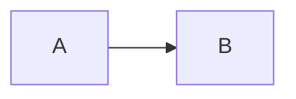
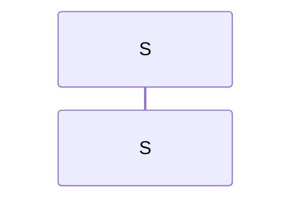

%% SYNTAX TEST "markdown.mermaid.codeblock" "multiple markdown block test"

::: mermaid
graph LR
%% <----- keyword.control.mermaid 
%%    ^^ entity.name.function.mermaid
  A --> B
%%^ variable
%%  ^^^ keyword.control.mermaid 
%%      ^ variable
:::

Parantaa endpointin toimivuutta ennaltamaar
%%%%%%%%%%%%%%%%%%%%%%%%%%%%%%%%%%%%%%%%%%% <--- meta.paragraph.markdown
tosiparemmilla looppi rectangulaareilla
%%%%%%%%%%%%%%%%%%%%%%%%%%%%%%%%%%%%%%% <--- meta.paragraph.markdown

:::mermaid
sequenceDiagram
%% <-------------- keyword.control.mermaid
  participant S as S
%%^^^^^^^^^^^ keyword.control.mermaid
%%            ^ variable 
%%              ^^ keyword.control.mermaid 
%%                 ^ string
:::

Parantaa endpointin toimivuutta ennaltamaar
%%%%%%%%%%%%%%%%%%%%%%%%%%%%%%%%%%%%%%%%%%% <--- meta.paragraph.markdown
tosiparemmilla looppi rectangulaareilla
%%%%%%%%%%%%%%%%%%%%%%%%%%%%%%%%%%%%%%% <--- meta.paragraph.markdown

Parantaa endpointin toimivuutta ennaltamaar
%%%%%%%%%%%%%%%%%%%%%%%%%%%%%%%%%%%%%%%%%%% <--- meta.paragraph.markdown
tosiparemmilla looppi rectangulaareilla
%%%%%%%%%%%%%%%%%%%%%%%%%%%%%%%%%%%%%%% <--- meta.paragraph.markdown

Parantaa endpointin toimivuutta ennaltamaar
%%%%%%%%%%%%%%%%%%%%%%%%%%%%%%%%%%%%%%%%%%% <--- meta.paragraph.markdown
tosiparemmilla looppi rectangulaareilla
%%%%%%%%%%%%%%%%%%%%%%%%%%%%%%%%%%%%%%% <--- meta.paragraph.markdown
