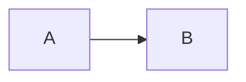

%% SYNTAX TEST "mdx.mermaid.codeblock"

```mermaid
graph LR
%% <----- keyword.control.mermaid
%%    ^^ entity.name.function.mermaid
  A --> B
%%^ variable
%%  ^^^ keyword.control.mermaid 
%%      ^ variable
```
